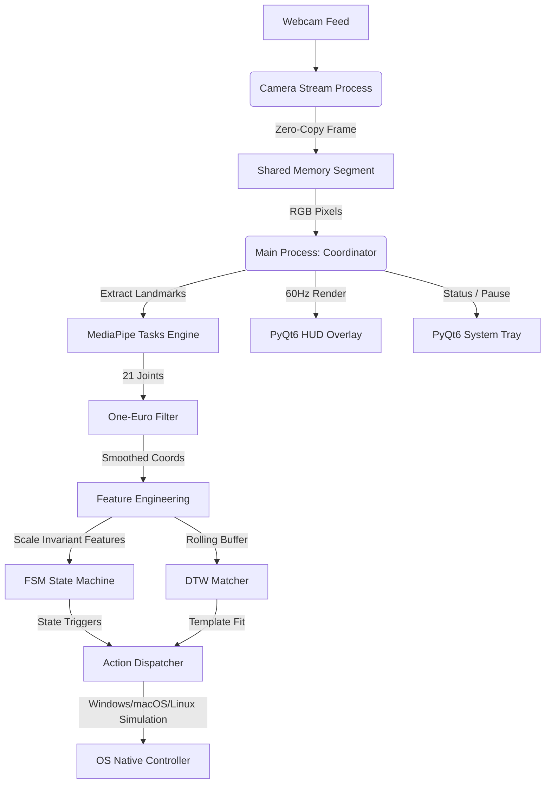

# Maestro: Cross-Platform Desktop Hand-Gesture Controller (!!!UNTESTED!!!)

Maestro is a production-grade, low-latency, cross-platform hand-gesture controller that translates real-time webcam video feeds into desktop system inputs (key combos, mouse movements, scrolling, window operations). Built with a high-performance multiprocessing architecture, Maestro isolates heavy machine learning landmark extraction from the OS simulation and UI event loops to deliver sub-millisecond gesture matching latency.

---

## ✨ Key Features

- **🚀 Multiprocessing Architecture:** Offloads webcam capture and MediaPipe landmark extraction to a dedicated worker process, bypassing Python's GIL.
- **⚡ Zero-Copy Shared Memory:** Shared memory segments act as a single-slot, zero-copy frame buffer between processes for minimum overhead.
- **📈 Vectorized Filtering:** One-Euro vectorized filter smooths high-frequency hand jitter dynamically based on depth and speed.
- **🧠 JIT-Compiled DTW Matcher:** Dynamic Time Warping (DTW) matching utilizing Numba JIT-compiled distance matrix algorithms for fast custom gesture recognition.
- **🔒 Secure AST Condition Parsing:** YAML-based gesture transition rules are safely parsed and compiled via strict AST allow-lists, preventing arbitrary code execution.
- **🔌 Dynamic Plugin Architecture:** Support for loading, validating (via JSON schema), and hot-reloading (via file watchdogs) custom gesture profiles and action handlers.
- **🎨 Glassmorphism Transparent HUD:** Translucent overlay built with PyQt6 that stays on top, rendering skeletal hand structures, FSM state progress rings, and event confirmation banners.
- **⚙️ Integrated Settings Dashboard:** Dark-mode configuration window featuring general adjustments, camera select, sensitivity sliders, hotkey capture, and a custom gesture recording canvas.

---

## 🏗 System Architecture

Maestro splits core responsibilities across isolated processes to guarantee UI responsiveness and tracking precision:



- **Camera Stream Process:** Captures camera frames via OpenCV, handles rotation/flip, and writes directly into the shared memory segment.
- **Main Coordinator Process:** Performs landmark extraction, engineering, FSM transition updates, custom gesture matching, UI rendering, and OS simulation.

---

## 🚀 Getting Started

### 📋 Prerequisites

Maestro requires Python 3.10+ (tested on Python 3.14.2 on Windows, macOS, and Linux).

### 🔧 Installation

1. **Clone the repository:**
   ```bash
   git clone https://github.com/aryansinghnagar/Maestro.git
   cd Maestro
   ```

2. **Install dependencies:**
   ```bash
   pip install -r requirements.txt
   pip install -r requirements-dev.txt
   ```

3. **Download the MediaPipe Task Model:**
   Maestro uses the official MediaPipe Hand Landmarker task file. Run the script to download it:
   ```bash
   python -c "import urllib.request; urllib.request.urlretrieve('https://storage.googleapis.com/mediapipe-models/hand_landmarker/hand_landmarker/float16/1/hand_landmarker.task', 'gesture_controller/data/hand_landmarker.task')"
   ```

4. **Verify Installation:**
   Run the post-install diagnostic script to verify that dependencies, camera, MediaPipe, and configuration paths are resolved:
   ```bash
   python scripts/verify_install.py
   ```

---

## 🛠 Usage

To run the application, execute:
```bash
python main.py
```

### 🎛 System Tray Integration
- **Green Icon:** Recognition is active.
- **Red Icon:** Recognition is paused.
- **Hover:** Displays live status (FPS, accumulated gesture count, state).
- **Double-click:** Opens the Settings Window.

### 🎨 HUD Overlay
Maestro renders a translucent skeletal hand representation directly over your screen. During gesture hold states (like scrolling), a progress ring will animate around the index finger joint. Once a gesture is successfully executed, a confirmation banner will flash at the bottom of the screen.

### 📹 Recording Custom Gestures
1. Double-click the tray icon to open **Settings**.
2. Navigate to the **Gestures** tab and click **Record Custom Gesture**.
3. Press **Start Recording** on the recorder dialog.
4. Perform the dynamic gesture 3 times in front of your camera.
5. Save the gesture and map it to an action (like keyboard hotkeys).

---

## 🔌 Plugin System

Maestro supports dynamic plugin discovery. Save your custom gesture configurations (`.yaml` or `.json` metadata) and python action scripts in `gesture_controller/plugins/`. 

Example plugin directory structure:
```
gesture_controller/plugins/
├── my_plugin/
│   ├── plugin.json       # Metadata containing author, version, and triggers
│   └── handlers.py       # Python file containing triggered action handlers
```

---

## 🧪 Testing

Maestro is accompanied by a full unit, integration, and E2E test suite built with `pytest` and `hypothesis`.

Run the full test suite:
```bash
python -m pytest gesture_controller/tests/
```

Verify coverage:
```bash
python -m pytest gesture_controller/tests/ --cov=gesture_controller
```

---

## 📄 License

This project is licensed under the **GNU Affero General Public License v3.0 (AGPL-3.0)**. See the [LICENSE](file:///c:/Users/Aryan/OneDrive/Desktop/Coding%20Projects/2-Hand%20Gesture%20Control/LICENSE) file for the full text.
