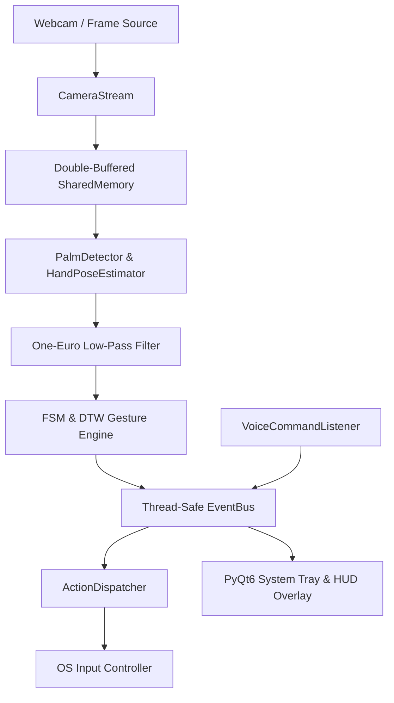

# Maestro Architecture Overview

Maestro is designed with a modular, event-driven, multiprocessing architecture focused on ultra-low latency (<15ms P50) and zero network egress.

---

## High-Level Architecture Diagram

---

## Core Components

### 1. Vision & Landmark Engine
- **PalmDetector**: ONNX Runtime model detecting palm bounding boxes and anchors.
- **HandPoseEstimator**: 21 3D hand landmark estimator with scale and rotation normalization.
- **Double-Buffered SharedMemory**: High-efficiency IPC transferring zero-copy video frames across process boundaries.

### 2. Filtering & Normalization
- **One-Euro Filter**: Dual adaptive low-pass filter smoothing landmark jitter while maintaining low phase lag during rapid motion.
- **Tremor Compensator**: Moving window displacement reducer for motor tremor stabilization.

### 3. Gesture Recognition
- **GestureFSMManager**: Multi-hand Finite State Machine engine executing AST-compiled boolean condition strings.
- **CustomGestureMatcher**: Fast Numba-accelerated Dynamic Time Warping (DTW) sequence matcher for custom recorded gestures.

### 4. OS Input Integration & Security
- **ActionDispatcher**: Maps recognized gestures to OS actions based on active foreground process name.
- **RateLimiter**: 3-tiered rate limiter (global 30/s, burst 10/100ms, per-gesture 5/s) preventing input flooding.
- **AuditLogger**: SHA-256 tamper-evident hash chain logging all stimulated actions.
