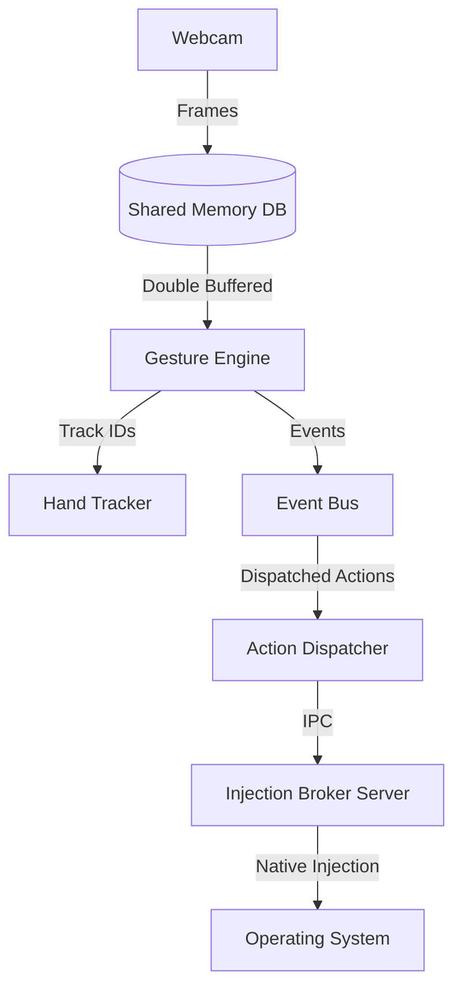

# Architecture Overview

Maestro utilizes a privilege-separated multiprocessing architecture to decouple the latency-critical vision loop from OS level actions.

```mermaid
graph TD
    Camera[Webcam] -->|Frames| SharedMemory[(Shared Memory DB)]
    SharedMemory -->|Double Buffered| Engine[Gesture Engine]
    Engine -->|Track IDs| HandTracker[Hand Tracker]
    Engine -->|Events| EventBus[Event Bus]
    EventBus -->|Dispatched Actions| ActionDispatcher[Action Dispatcher]
    ActionDispatcher -->|IPC| Broker[Injection Broker Server]
    Broker -->|Native Injection| OS[Operating System]
```
