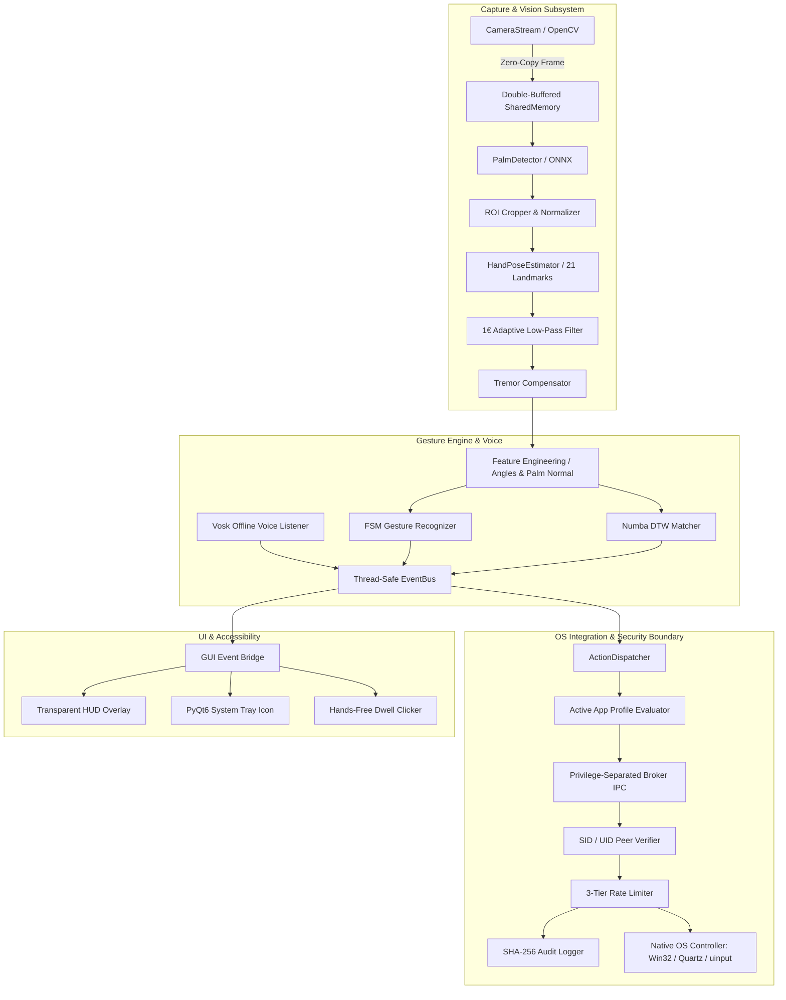

# Maestro Architecture & System Design

Maestro is engineered as a decoupled, multi-threaded, real-time edge processing engine designed to achieve sub-15ms P50 latency without compromising process security or user privacy.

---

## 1. System Topology & Data Flow


```mermaid
graph TD
    subgraph Capture & Vision Subsystem
        Cam[CameraStream / OpenCV] -->|Zero-Copy Frame| SHM[Double-Buffered SharedMemory]
        SHM --> Palm[PalmDetector / ONNX]
        Palm --> Crop[ROI Cropper & Normalizer]
        Crop --> Pose[HandPoseEstimator / 21 Landmarks]
        Pose --> Filter[1€ Adaptive Low-Pass Filter]
        Filter --> Tremor[Tremor Compensator]
    end

    subgraph Gesture Engine & Voice
        Tremor --> Feat[Feature Engineering / Angles & Palm Normal]
        Feat --> FSM[FSM Gesture Recognizer]
        Feat --> DTW[Numba DTW Matcher]
        Voice[Vosk Offline Voice Listener] --> EventBus
        FSM --> EventBus[Thread-Safe EventBus]
        DTW --> EventBus
    end

    subgraph OS Integration & Security Boundary
        EventBus --> Dispatch[ActionDispatcher]
        Dispatch --> Profile[Active App Profile Evaluator]
        Profile --> Broker[Privilege-Separated Broker IPC]
        Broker --> Auth[SID / UID Peer Verifier]
        Auth --> Rate[3-Tier Rate Limiter]
        Rate --> Audit[SHA-256 Audit Logger]
        Rate --> Inject[Native OS Controller: Win32 / Quartz / uinput]
    end

    subgraph UI & Accessibility
        EventBus --> QtBridge[GUI Event Bridge]
        QtBridge --> Overlay[Transparent HUD Overlay]
        QtBridge --> Tray[PyQt6 System Tray Icon]
        QtBridge --> Dwell[Hands-Free Dwell Clicker]
    end
```

---

## 2. Core Subsystems

### 2.1 Double-Buffered Shared Memory (Zero-Copy Ingestion)
To prevent video frame acquisition from bottlenecking inference, `CameraStream` and `FramePipeline` communicate via lock-free, double-buffered POSIX/Windows shared memory (`DoubleBufferedFrameBuffer`):
- **Ring Buffer**: Writer writes to `Buffer A` while Reader reads `Buffer B`.
- **Atomic Pointer Swap**: Swaps active memory pages with atomic integer increment upon frame completion.
- **Watchdog Recovery**: The camera acquisition thread operates an isolated watchdog with exponential backoff if the USB device drops or stalls.

### 2.2 Vision Engine & Hardware Backends
Landmark extraction runs through ONNX Runtime, dynamically selecting the highest performance execution provider:

| Platform | Preferred Execution Provider | Fallback |
|---|---|---|
| **Windows** | DirectML (`DmlExecutionProvider`) | CPU (`CPUExecutionProvider`) |
| **Linux (NVIDIA)** | TensorRT / CUDA (`TensorrtExecutionProvider`, `CUDAExecutionProvider`) | CPU |
| **macOS (Apple Silicon)** | CoreML (`CoreMLExecutionProvider`) | CPU |

### 2.3 Adaptive Performance Tier Manager (T0–T3)
To ensure smooth responsiveness across low-power laptops and high-end workstations alike, the `TierManager` continuously monitors frame processing time, CPU utilization, and battery/thermal state:

```
[Tier 0: Ultra]       60 FPS | FP16 Precision | Full HUD Overlay | Multi-Hand
      ▲   ▼  (Load > 75% or Frame Latency > 30ms)
[Tier 1: Balanced]    30 FPS | FP16 Precision | Standard HUD     | Multi-Hand
      ▲   ▼  (Load > 85% or Battery Discharging)
[Tier 2: Power Saver] 20 FPS | INT8 Precision | Minimal HUD      | Single-Hand
      ▲   ▼  (Severe Thermal Throttling / Low Battery)
[Tier 3: Minimal]     10 FPS | INT8 Precision | No HUD / Audio Only
```

### 2.4 Hybrid Gesture Recognition: FSM + DTW
- **Finite State Machine (FSM)**:
  - Evaluates boolean conditions compiled via Python AST parsing (e.g. `index_finger_extended and thumb_distance < 0.05`).
  - Implements per-state entry/exit actions, transition hysteresis, and configurable debounce cooldowns.
- **Dynamic Time Warping (DTW)**:
  - Used for dynamic, multi-frame user gestures (waving, drawing shapes).
  - Uses JIT-compiled Numba distance matrix computations achieving sub-microsecond evaluation times over 60-frame landmark sequences.

### 2.5 Offline Speech Recognition (Vosk)
- Operates on a dedicated background thread reading 16kHz PCM audio from PyAudio / SoundDevice.
- Runs completely offline without cloud API requests.
- Implements wake-word gating (`"maestro"`) with sliding 5-second command windows.

---

## 3. Security Architecture & Privilege Separation

### 3.1 Input Broker & OS Privilege Boundaries
On modern desktop OSs, injecting input into elevated administrative applications requires elevated rights or special IPC tokens:
- **Windows**: The Maestro Broker runs over named pipes with explicit Access Control Lists (ACLs). When a client connects, the broker calls `OpenProcessToken` and validates the peer process Security Identifier (SID) matches the logged-in interactive user before accepting input injection packets.
- **Linux**: The broker validates client credentials via `SO_PEERCRED` on Unix domain sockets, enforcing UID equivalence.
- **Fail-Closed Design**: Any authentication failure or exception immediately closes the connection and records a rejection event.

### 3.2 Three-Tiered Rate Limiter
Prevents accidental or malicious input flooding:
1. **Global Cap**: Maximum 30 injected events per second.
2. **Burst Limit**: Maximum 10 events within any 100ms window.
3. **Per-Gesture Cooldown**: Minimum 200ms debounce between identical gesture triggers.

### 3.3 Tamper-Evident SHA-256 Audit Log
Every stimulated input event is appended to `audit.log` as a cryptographically linked blockchain-style hash chain:
\[
H_i = \text{SHA-256}(H_{i-1} \parallel \text{Timestamp} \parallel \text{Gesture} \parallel \text{Action} \parallel \text{CallerPID})
\]
Integrity can be validated at any time using `maestro verify-audit-log`.

### 3.4 TUF-Signed Auto-Updates
Auto-updates follow The Update Framework (TUF) specification with Ed25519 signature threshold verification ($N \ge 3$) to guarantee authenticity and rollback protection.

