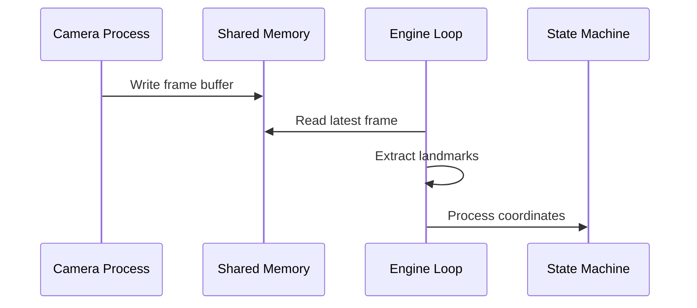

# Pipeline Diagram

```mermaid
sequenceDiagram
    participant Cam as Camera Process
    participant Shm as Shared Memory
    participant Eng as Engine Loop
    participant FSM as State Machine
    Cam->>Shm: Write frame buffer
    Eng->>Shm: Read latest frame
    Eng->>Eng: Extract landmarks
    Eng->>FSM: Process coordinates
```
