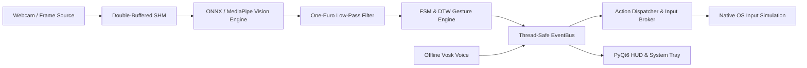

# Maestro Documentation

**Cross-platform desktop hand-gesture controller. Control your computer with natural hand gestures and offline voice commands via webcam.**

---

## What is Maestro?

Maestro is a high-performance, real-time desktop background service and GUI application that turns standard webcam video into low-latency OS input commands. It bridges computer vision (MediaPipe / ONNX Runtime), stateful gesture recognition (FSM condition evaluator & Dynamic Time Warping), offline speech recognition (Vosk), and native OS input injection (Windows `SendInput`, macOS `Quartz/CGEvent`, Linux `uinput`/X11).

---

## Key Highlights

| Feature | Description |
|---|---|
| **Adaptive Performance Tiers (T0–T3)** | Dynamically scales workload from Ultra (T0: 60 FPS, FP16 model, full HUD) to Minimal (T3: 10 FPS, INT8 model, battery-saver mode) based on CPU load, battery, and thermal state. |
| **Multi-Backend GPU Acceleration** | Native hardware execution via DirectML (Windows), CoreML (macOS), TensorRT / CUDA (Linux/NVIDIA), or optimized CPU fallback. |
| **Decoupled Architecture** | Lock-free double-buffered shared memory pipeline ensuring frame ingestion never blocks OS input dispatch or GUI rendering. |
| **Dual Recognition Engine** | Fast AST-compiled boolean logic for continuous state machine gestures (e.g. Swipes, Fists, Pinches) plus Numba-accelerated DTW for custom recorded patterns. |
| **100% On-Device Privacy** | Zero network egress. Camera frames, hand landmark coordinates, and audio streams never leave your machine. |
| **Privilege-Separated Input Broker** | Isolated broker service with Win32 process token SID auth / POSIX UID checks, 3-tiered rate limiting, and SHA-256 tamper-evident audit logging. |
| **Extensible Sandboxed Plugins** | Dual plugin runtime supporting Python plugins (`pluggy` hooks, `RestrictedPython` namespace isolation) and WebAssembly modules (`wasmtime`). |
| **WCAG 2.2 AA Accessibility** | Jitter-suppressing One-Euro filters, motor tremor auto-calibration, hands-free dwell-clicker, full screen reader support (NVDA, VoiceOver, Orca), and high contrast themes. |

---

## Performance Targets

| Metric | Target / Benchmark Result |
|---|---|
| **E2E Latency (P50, GPU)** | `<15ms` |
| **E2E Latency (P50, CPU)** | `<30ms` |
| **One-Euro Filter Iteration** | `<15µs` |
| **DTW Distance Matrix Evaluation** | `<500ns` |
| **FSM State Evaluation** | `<25µs` |
| **Memory Footprint** | `<200MB` |
| **Cold Start Time** | `<1.5s` |

---

## Quick Navigation

-   :material-rocket-launch:{ .lg .middle } **[Getting Started](getting-started.md)**

    ---

    System requirements, prerequisites, and step-by-step installation guides for Windows, macOS, and Linux.

-   :material-book-open-page-variant:{ .lg .middle } **[User Guide](user-guide.md)**

    ---

    Detailed manual on system tray controls, built-in gestures, custom DTW recording, voice commands, and dwell clicker.

-   :material-cog:{ .lg .middle } **[Configuration Guide](configuration.md)**

    ---

    Complete `config.yaml` schema reference, environment variable overrides, and dynamic hot-reload configuration.

-   :material-layers-triple:{ .lg .middle } **[Architecture & Design](architecture.md)**

    ---

    Deep-dive into the multiprocessing frame pipeline, event bus, tier manager, and privilege-separated security boundaries.

-   :material-code-tags:{ .lg .middle } **[Developer Guide](developer-guide.md)**

    ---

    Local development setup with `uv`, code standards, testing hierarchy, and contribution workflow.

-   :material-puzzle:{ .lg .middle } **[Plugin Development](plugin-development.md)**

    ---

    Build custom Python (`pluggy`) and WebAssembly (`wasmtime`) plugins with hook specifications and sandboxing rules.

-   :material-human:{ .lg .middle } **[Accessibility](accessibility.md)**

    ---

    WCAG 2.2 AA compliance, tremor compensation calibration, dwell clicking, and assistive technology integration.

-   :material-api:{ .lg .middle } **[API Reference](api-reference.md)**

    ---

    Auto-generated module references and interface definitions for all Maestro core and vision components.

-   :material-wrench:{ .lg .middle } **[Troubleshooting](troubleshooting.md)**

    ---

    Actionable fixes for camera access, OS permissions, UIPI elevation, voice models, and crash reports.

-   :material-frequently-asked-questions:{ .lg .middle } **[FAQ](faq.md)**

    ---

    Frequently asked questions regarding privacy, performance, multi-monitor setups, and compatibility.

