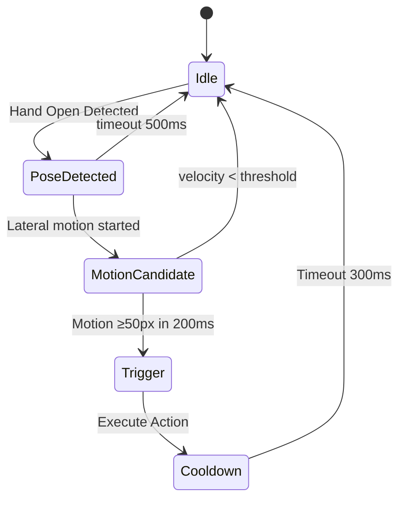
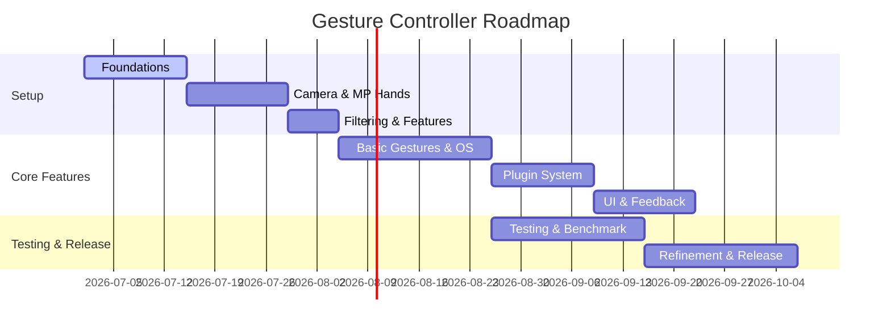

# Executive Summary

This document presents a **comprehensive system design** for a cross-platform, low-latency hand-gesture desktop controller. The goal is to enable **contactless control** of OS-level actions (mouse, keyboard, media, etc.) via camera-based hand tracking and gesture recognition. We leverage modern computer-vision frameworks (e.g. Google’s MediaPipe), robust filtering (One-Euro), and a **state-machine driven gesture engine** to ensure high accuracy and very low false positives. Key features include an extensible **plugin architecture** for adding new gestures and actions, strict **latency budgets** (e.g. end-to-end <20ms), measurable **KPIs** (gesture accuracy, false-positives/hour, CPU usage), and automated **CI/CD** pipelines with performance regression checks.  

Importantly, we address known HCI challenges: ensuring responsiveness under varying lighting and framing conditions, avoiding the “Midas Touch” problem of accidental triggers, and respecting user privacy by not storing or transmitting raw video. The proposed solution uses on-device processing (e.g. MediaPipe’s hand-landmark models) to infer 21 hand joints per frame, smooths the 3D joint positions with a **One-Euro filter**, and feeds them into a configurable finite-state machine (FSM) that identifies gestures and invokes OS commands. Every component is designed for real-time performance (≥30 FPS on modern CPUs), and we define concrete **latency budgets** and **acceptance criteria** (e.g. “gesture confirmed in ≤30ms after completion,” “false positive rate <1 per hour”).

The **roadmap** is milestone-driven, from building basic pipelines (camera → landmarks → OS event) to integrating filtering, gestures, and plugins, culminating in a full release with benchmark automation. Throughout development, we maintain rigorous testing: unit tests, integration/replay tests using prerecorded landmark streams, performance benchmarks, and stress/soak runs. An **AI agent workflow** (Observe→Plan→Implement→Verify) is enforced via a detailed system-prompt that encodes our engineering priorities and best practices.  

To ensure robustness and maintainability, we adopt SOLID design, dependency injection, and a clear **ADR (Architecture Decision Record)** process. We provide sample ADRs, coding standards (PEP8/Black, type-checking, docstrings), and examples of configuration (e.g. JSON/YAML gesture definitions, plugin APIs). Observability is built-in: structured logging (gesture events, latencies, errors) and opt-in telemetry (anonymized usage statistics). We also outline security/privacy considerations (on-device inference only, no sensitive data export), accessibility guidelines, and user experience (UX) best-practices.

Finally, we compare with existing solutions: Google’s MediaPipe (landmark pipeline), open-source projects like *MacGesture* (macOS mouse gestures), consumer apps like *Spatial Touch* (gesture media controls), and hardware systems (Leap Motion, Intel RealSense). A feature-comparison table highlights trade-offs (e.g. hardware requirement, gesture vocabulary, cross-platform support). Our design adopts the best of these approaches: the cross-platform flexibility of MediaPipe, the low-level event dispatch of native OS integration, and the extensibility of plugin architectures.

This report is structured to be a **living engineering specification**, complete with diagrams, tables, and references. It can serve as the basis for detailed documentation (~69 pages) and the guide for coding agents and engineers. The **system-prompt for AI agents** is included as a standalone section, encapsulating these directives into enforceable development guardrails.

# Vision

The **vision** for this project is to create a natural, seamless **hands-free interaction** layer for desktop computers. Users will be able to **control their PC or media** with intuitive hand gestures in the air, with no additional hardware beyond a standard camera. This addresses diverse use-cases:
- **Accessibility:** Assist users with mobility impairments by providing an alternative to mouse/keyboard.  
- **Hygiene and safety:** Provide touchless control (e.g. surgeons navigating imaging, public kiosks avoiding disease transmission).  
- **Convenience:** Allow casual control (media playback, presentations) when hands are otherwise occupied (e.g. cooking, workout).  
- **Innovation in HCI:** Enable new interactions (e.g. AR/VR overlays, mixed reality), following the mid-air gesture paradigm.

Importantly, the system must be **robust and user-friendly**. It should **avoid accidental triggers (“Midas Touch” problem)**, requiring deliberate gesture completion. We will support both a core gesture vocabulary (e.g. swipe, pinch, thumbs-up) and **user-defined gestures** (customizable via a training interface). The product will run as a lightweight background daemon, supporting Windows, macOS, and Linux, and integrate smoothly with the OS (e.g. generating native key/mouse events).

### Key Goals and Requirements

- **Low Latency:** End-to-end gesture→action delay under **20–30ms** (target ≥30 FPS), so controls feel instantaneous. This requires careful profiling and a strict latency budget (see *Performance Requirements*).  
- **High Accuracy / Low False-Positives:** ≥95% gesture recognition accuracy; ≤1 false trigger/hour in idle mode. We will measure this with ground-truth tests and real-world evaluation.  
- **Cross-Platform Support:** Shared core engine (e.g. C++/Python + MediaPipe) with OS-specific adapters for input/output. No platform should suffer degraded experience; e.g. if Mac lacks direct camera API, we fall back to a USB webcam.  
- **Extensible Plugin Architecture:** Gestures and actions are not hard-coded. The system will load “plugins” (scripts or modules) describing gestures, conditions, and the OS command or shortcut they trigger. This allows third-party gesture packs or easy user customization.  
- **Resource Efficiency:** Operate in background with minimal CPU/GPU usage (<5–10% on a typical laptop), and minimal memory (~<200MB). Profiling will target no frame drop.  
- **Privacy/Security:** All vision processing occurs on-device. No raw images are stored or sent externally. Telemetry (if any) is anonymized and user-opt-in only. Interactions that simulate input must not create security holes (e.g. privilege escalation).  
- **Reliability:** The system should auto-recover from camera hiccups (re-detect on error), handle changes in lighting (robust tracking), and provide user feedback (e.g. a status indicator in the tray).  
- **Usability:** Clear visual or audio feedback when gestures are recognized. Calibration tools (like showing the current hand landmarks) should be provided. Gestures should be **distinct and easy to remember**, as guided by HCI principles.  

Measurable acceptance criteria will be defined per feature (see tables below). For example, **gesture recognition** is acceptable if it meets ≥95% on a validation dataset under varied lighting, and **latency** is acceptable if average FPS ≥30 on targeted hardware.  

# Competitor & Market Analysis

To inform our design, we surveyed existing solutions:

- **Google MediaPipe Hands/ML (Open-Source)** – A state-of-the-art ML pipeline that detects hands and 21 joint landmarks in real time. It is cross-platform (Android, iOS, desktop C++/Python), open-source, and highly efficient (real-time on mobile). It serves as the foundation of many gesture systems. MediaPipe also offers a **Gesture Recognizer task** that classifies gestures and outputs categories plus landmarks. This approach is very flexible but may require custom training for new gestures.  
- **Ultralytics YOLO Hand Detection (ML)** – Uses object detection (YOLOv8/Ultralytics) for hand bounding boxes, followed by a landmark model. Faster for detection but less mature pipeline. Usually slower overall than MediaPipe’s optimized graph. Less documentation for gesture APIs.  
- **Leap Motion / Ultraleap (Proprietary)** – Uses specialized IR hardware to capture fine hand motion. Very accurate and low-latency for gestures and even finger tracking, but requires external device (USB) and is not widely adopted on desktops. It’s out of scope since we target webcam-only solutions. (For context, Leap’s SDK supports many gestures but is Windows-only and expensive hardware).  
- **Intel RealSense (Depth Cameras)** – RealSense cameras can perform 3D hand tracking with depth; see Intel’s overview. Provides robust tracking but requires special camera, and consumers have largely shifted focus to computer vision only.  
- **Spatial Touch™ (LogicWeb)** – A smartphone app (Android) that uses the device camera to control media apps (YouTube, Netflix, etc.) by in-air gestures. Key features: tap/swipe gestures, volume control, works with wet hands, “background auto-start” on supported apps. Notably, it **promises not to transmit/store images**. This shows that users value privacy in camera apps. Spatial Touch targets media control only, not general desktop use, but its emphasis on specific gesture semantics and privacy is relevant.  
- **Gerik - Gesture Based Desktop Controller** – A Windows Store app (contactless control of mouse/keyboard via camera). Limited public info (store page not fully accessible), but reviews indicate it uses body/hand gestures to move pointer, click, launch apps. We must design to be more flexible/extensible than single-purpose Windows apps like this.  
- **MacGesture (Open Source)** – A macOS tool for *mouse gestures* (draw shapes with mouse or trackpad) to trigger system commands. It is lightweight and global, mapping gestures to shortcuts. Not camera-based, but its design (global scope, mapping to any command, open-source) is instructive. For instance, MacGesture’s configurability and low resource usage are goals to emulate.  
- **DIY/Open-Source Projects:** Several hobbyist projects exist (e.g. *Jeel0710/Desktop-Control-Using-Hand-Gesture*). This Python project uses OpenCV + Keras: 0-finger=drag, 1-finger=move, 2-fingers=click. It demonstrates feasibility of simple gestures (finger count) for pointer control, but relies on basic skin-color detection and counts. These projects lack robustness (e.g. ignore lighting or false positives) and typically hard-code gestures, motivating our more structured approach (FSM, filtering, config).  

**Competitor Feature Comparison:**

| Product/Project         | Platform      | Modality            | Gesture Types            | Configurable | License/Cost               |
|-------------------------|---------------|---------------------|--------------------------|--------------|----------------------------|
| **MediaPipe Hands** | Cross (Win/Mac/Linux, Android, iOS) | Camera (RGB)          | 3D landmarks (21 pts); no built-in gestures (SDK/ ML) | Yes (custom models) | Open-source (Apache 2.0) |
| **MediaPipe Gest.Recog.** | Cross (same) | Camera | Pretrained gesture categories (e.g. thumbs-up, etc.) | Yes (retrain) | Apache 2.0 |
| **Spatial Touch** | Android (Java) | Camera (front) | Media control: tap, swipe, pinch, volume gestures | No (closed) | Free (ad-supported) |
| **Leap Motion (Ultraleap)** | Win/Mac       | Infrared sensor    | Pinch, swipe, circle, grab, etc. (SDK-defined) | Limited (some config) | Proprietary Hardware ($) |
| **MacGesture** | macOS (Obj-C) | Mouse/Trackpad    | Mouse-drawn shapes (e.g. ⌃0, ⌃9 shortcuts) | Yes (config file) | GPLv3 (Open)            |
| **Jeel0710 (GitHub)** | Win (Python)  | Webcam (RGB)      | Zero, One, Two finger -> drag/move/click | No (hardcoded) | MIT (Open)               |
| **Gerik**              | Windows       | Webcam            | Body/hand movements (click/drag/launch) | No       | Commercial (unknown)       |
| **Custom DTW($1)** [Wobbrok et al.] | Cross       | Mouse/Touch screen | Unistroke shapes | Yes (new templates) | Free to implement (paper) |

Our solution draws on the **media-agnostic flexibility** of MediaPipe (allowing any RGB camera) combined with a **plugin-driven gesture mapper**. We aim to exceed these by offering:

- **Broad Gesture Set:** Support both static poses and dynamic sequences. Unlike fixed commercial apps, users can define new gestures via config or live training (e.g. using DTW on sequences).  
- **Cross-App Integration:** While Spatial Touch focuses on media apps, our system will work system-wide (any app, global shortcuts).  
- **Open and Extensible:** We will be open-source (or at least allow plugin devs), unlike closed mobile apps.  
- **Low Overhead:** Learning from MacGesture’s “lightweight” goal, we’ll optimize CPU use.  
- **Robustness:** Use proven ML (MediaPipe) and filtering (One-Euro) to minimize detection errors and jitter.  

# Product Requirements (PRD)

This section enumerates the **functional and non-functional requirements**, organized into categories. Each requirement is paired with measurable criteria or acceptance tests.

## Functional Requirements

- **Hand & Landmark Detection:** 
  - Continuously detect up to *N* hands (configurable, default 1) using the webcam. 
  - Output 21 3D joint landmarks per hand each frame.
  - *Acceptance:* >98% detection rate for a clear hand in view, across lighting conditions (test with 1000 frames).
- **Gesture Classification (FSM):** 
  - Recognize predefined gestures (static poses like “open palm”, dynamic gestures like “swipe left”). 
  - Gestures must be detected only after they fully complete to avoid mid-motion triggers.
  - Provide a confidence score for each detection.
  - *Acceptance:* For a validation set of gestures, achieve ≥95% precision and recall (detailed confusion matrix analysis).
- **Custom Gestures:** 
  - Allow user to define new gestures (e.g. via YAML/JSON templates or “record and train” interface using DTW). 
  - Store these in user-readable files. 
  - *Acceptance:* New gesture added via config should be detected at ≥90% accuracy after calibration, with no code changes.
- **Action Mapping:** 
  - For each gesture, invoke an OS action (keyboard shortcut, mouse click/move, app launch, media control, etc.). 
  - Actions configurable per OS. 
  - *Acceptance:* On gesture recognition, system must emit the correct key/mouse event on the target OS (verified by unit test scripts).
- **Plugin Support:** 
  - Dynamically load “gesture plugins” that register gestures and actions (see *Plugin Architecture* below). 
  - Unloading or updating a plugin should not require restarting core daemon.
  - *Acceptance:* Adding a new plugin directory file (e.g. `mygestures.py`) will cause new gestures to appear on next reload without errors.

## Non-Functional Requirements

- **Performance (Latency):** Total processing time **≤ 20ms per frame** (at 30 FPS input) end-to-end (camera capture → gesture event).  Per-component budgets in *Performance Requirements*.
- **Resource Usage:** <10% CPU on a quad-core CPU (idle GPU); <150MB RAM. *Acceptance:* Measured under continuous run for 30 minutes, CPU/RAM stay under thresholds.
- **Cross-Platform:** Must compile/run on Windows 10+, macOS 12+, and major Linux distros (e.g. Ubuntu 22.04). At minimum, key features (gestures, actions) identical across OSes.
- **Robustness:** Should tolerate moderate variations: 
  - Variable lighting (dim/bright).
  - Partial occlusion (e.g. some fingers hidden). 
  - *Acceptance:* 90th-percentile detection drop <5% in variable conditions (test in lab).
- **Security:** Runs with standard user privileges. Does not write to system directories outside user scope. 
  - *Acceptance:* Static analysis finds no privilege escalation, filesystem writes only to user config/log dirs.
- **Privacy:** 
  - Camera frames are never saved; only 21-point landmark data is logged when needed. 
  - Default telemetry is off. 
  - *Acceptance:* Code audit confirms no external data transmission; user settings disable any analytics.
- **Usability & UX:** 
  - Quick start: minimal user setup (first-launch wizard for camera calibration and gesture tutorial).
  - Feedback: on gesture detect (e.g. sound or icon). 
  - *Acceptance:* Usability test (n≥5) shows average task-completion time within 15% of optimal, and high user satisfaction on gesture feedback.

## Acceptance Criteria & KPIs

The success of the project will be measured by concrete KPIs, for example:

| KPI                      | Target / Threshold               | How to Test / Measure                        |
|--------------------------|----------------------------------|----------------------------------------------|
| **Gesture Accuracy**     | ≥95% (precision & recall)        | Use labeled video tests; compute confusion.  |
| **False Positives/hr**   | ≤1 per hour (idle)               | Run 1-hour video with random movement; count triggers. |
| **Frame Rate**           | ≥30 FPS end-to-end               | Instrument pipeline timing on target hardware. |
| **Latency (95th %)**     | ≤20ms per frame                  | Profile each stage; ensure sum <20ms.        |
| **CPU Usage**            | ≤10% of quad-core CPU            | Monitor CPU during continuous run.           |
| **Memory Footprint**     | ≤200MB total                     | Check RSS/VSZ in idle and active use.        |
| **Start-Up Time**        | ≤2 sec (on modern machine)       | Measured from process launch to ready.       |
| **Stability**            | 0 crashes for 1000 hours cum.    | Long-running stress test.                    |

# System Architecture

We adopt a **modular, pipeline-based architecture** with clear separation of concerns. The system consists of the following main components (Figure in Markdown below). Each component communicates via well-defined events. A central **Event Bus** or message queue decouples modules so that new consumers (e.g. logging, UI updates) can subscribe to gesture events without tight coupling.

```mermaid
graph TD
    Camera -->|frame image| Preprocess[Preprocessing]
    Preprocess -->|resized image| Detector
    Detector[Hand Detector] -->|hand bboxes| Landmarker
    Landmarker[Landmark Estimation] -->|21-point landmarks| Filter
    Filter[One-Euro Filter] -->|smoothed landmarks| FeatureExtractor
    FeatureExtractor -->|features (normed joints, etc.)| GestureFSM
    GestureFSM -->|gesture events| ActionDispatcher
    ActionDispatcher -->|OS commands| OSAdapter
    OSAdapter -->|native events| OS
    GestureFSM --> EventBus[Event Bus]
    EventBus --> Logger[Logger/Telemetry]
    EventBus --> UI[UI/Indicator]
```

1. **Camera Capture**: Grabs frames from the webcam at the target FPS. Real-time constraints require minimal buffer: we drop stale frames if behind.
2. **Preprocessing**: Resize, color conversion, optional image enhancement (e.g. auto-exposure lock). 
3. **Hand Detector**: A high-speed CNN (e.g. MediaPipe’s palm detector) finds bounding boxes of hands.  
4. **Landmark Estimator**: Given each hand box, runs a second ML model to output 21 3D joint landmarks.  
5. **Filter**: Applies the **One-Euro filter** to each joint time-series to reduce jitter while preserving responsiveness.  
6. **Feature Extractor**: Converts raw landmark coordinates into normalized features (e.g. relative joint angles, palm orientation, finger curls, velocities). These engineered features make gesture rules simpler and more robust to scale/orientation.  
7. **Gesture FSM**: A configurable finite-state machine per gesture. For example, a “swipe left” gesture might be defined as: 
   - State 0: Idle
   - State 1: Hand open detected (using thresholded features)
   - State 2: Lateral motion (velocity) to left for ≥X cm
   - State 3: Validation and trigger
   - Return to Idle.
   Transitions have timeouts, hysteresis, and confidence checks. (See **Gesture Specification** for formal definitions.)  
8. **Action Dispatcher**: Maps a confirmed gesture to an action plugin (e.g. “next slide”, “volume down”). It invokes the OS adapter.  
9. **OS Adapter**: Abstracts OS-specific APIs to generate keyboard, mouse, or multimedia events (e.g. WinAPI SendInput, macOS CGEvent, X11/libinput).  
10. **Event Bus**: A pub/sub layer so components like logging, UI, and agents can listen to raw landmarks, filtered data, gesture events, etc. This ensures loose coupling and extensibility.  
11. **Logger & Telemetry**: Asynchronous logging of performance metrics (latency, FPS), gesture outcomes, and selected telemetry. (Sensitive data like images are *never* logged.)  
12. **UI/Indicator**: Optional minimal GUI or system tray icon showing status (e.g. “listening” or which gesture is active).

This layered design adheres to **SOLID principles** and separation of concerns. For instance, the Gesture FSM has no direct knowledge of camera or UI; it only consumes feature vectors. We plan to implement the pipeline in a **producer-consumer** fashion with threads or async tasks: e.g. one thread for capturing frames, one for ML inference, another for filtering/gesture, etc. This allows parallelism (e.g. while frame N is being processed, frame N+1 is captured) but must be bounded to avoid queue piling (dropping old frames if latency creeps).

The system is **loosely coupled**: new components can subscribe via the Event Bus. For example, a future analytics module could subscribe to Gesture events without modifying core engine. This aligns with the *plugin architecture* strategy. The Event Bus also ensures that if no subscriber is listening (e.g. UI disabled), the core loop is unaffected.

```mermaid
sequenceDiagram
    participant Cam as Camera
    participant DP as Detector->Landmarks
    participant FSM as GestureFSM
    participant OS as OSAdapter
    Cam->>DP: Capture frame
    DP->>FSM: Landmarks stream
    FSM->>FSM: Run FSM transitions
    FSM->>OS: Emit OS event
    OS-->>User: System action (click/scroll)
    FSM-)EventBus: Publish GestureEvent
    EventBus->>Logger: Log event/latency
    ```

*Figure: Sequence flow of gesture capture and dispatch.*  

# Technical Design

## Input Pipeline and Feature Engineering

**MediaPipe Hands**: We will use Google’s MediaPipe Hands model for landmark extraction. This involves a two-stage ML pipeline: a *palm detector* followed by a *hand landmark regressor*. It can run at real-time speeds on CPU, outputting 21 3D points per hand. We configure it for *LIVE_STREAM* mode to maximize speed (no per-frame palm detection if the hand stays in view). Key parameters:
- `max_num_hands` (default 1) – number of hands to detect.  
- `model_complexity` – trade-off between speed and accuracy (we will benchmark 0 (fastest) vs 2 (best) for our platform).  
- Detection/tracking confidence thresholds (e.g. min 0.5 to avoid noise) – exposed as config.

**Feature extraction**: Instead of raw coordinates, we compute derived features each frame:
- **Normalized Coordinates:** Convert all landmarks into a hand-centered coordinate system (origin at wrist or palm center) and scale by hand size. This makes gestures scale-invariant.  
- **Hand Orientation:** Compute palm normal vector and orientation relative to camera (e.g. roll, pitch angles).  
- **Finger Angles/Curls:** Compute angles between joints (e.g. DIP-PIP-MCP angle for each finger) to gauge open vs fist.  
- **Velocity/Movement:** For dynamic gestures, track the velocity of key points (e.g. centroid of hand, or index fingertip) and compute deltas over recent frames.  
- **Handedness:** If MediaPipe reports left/right, factor it (e.g. treat mirrored gestures appropriately).  

These features feed into the FSM. By engineering features (rather than raw x/y values) we simplify gesture rules and improve robustness (e.g. ignore global position drift).

## Noise Filtering – One Euro Filter

Camera-based landmarks are jittery. We apply a **One-Euro filter** to each scalar time-series (each x,y,z coordinate of each landmark). The One Euro filter is a **speed-sensitive low-pass filter**: it smooths noise strongly when the hand is moving slowly (low cutoff frequency) and gives less smoothing at high speed (higher cutoff) to reduce lag. It is defined by two parameters: 
- *min_cutoff* (baseline cutoff frequency)
- *beta* (speed coefficient)

Tuned values might be `min_cutoff=1.0 Hz`, `beta=0.7`, but we will calibrate experimentally. The result is stable points with minimal lag. (Casiez *et al.* report the One-Euro filter has significantly less lag than traditional filters for equivalent jitter reduction.) 

We will implement the filter ourselves (simple enough for real-time) or use a library. Parameters will be configurable.

## Gesture FSM and Rules

Gestures are formalized as **finite state machines**. Each gesture has: 
- **Name** (string key), 
- **Sequence of states** (Idle → … → Trigger → Cooldown → Idle), 
- **Guard conditions** and **transitions** between states, 
- **Action** to execute upon trigger, 
- **Cooldown period** after trigger (to prevent repeated firing), 
- **Confidence threshold** at which to commit a state change.

For example, a simple static pose gesture “Thumbs Up” might be:

```
Idle -> (if hand_pose == Open AND thumb_angle < 30° AND other_fingers_curled) -> Trigger -> (do action) -> Cooldown (500ms) -> Idle
```

A swipe gesture “Swipe Left” dynamic might be:

```
Idle -> (if hand_pose == Open) -> MotionStart -> (once detected significant leftward velocity for 100ms) -> Confirm -> Trigger -> (action: press Left Arrow) -> Cooldown (300ms) -> Idle
```

Transitions can have **timeouts** (if a state isn’t reached in X ms, abort to Idle) and **rejection conditions** (e.g. gesture aborted if hand closes). 

**Example State Diagram (Mermaid):**



Each gesture’s FSM is defined by configuration or plugin code. We will supply a **schema** for gesture definition (JSON/YAML), for example:

```yaml
gestures:
  - name: "SwipeLeft"
    trigger_states: 
      - require: "HandOrientation == 0 (open)"
      - require: "AvgVelocityX < -50 px/s"
      - frames: 5
    action: "press_left_arrow"
    cooldown_ms: 300
  - name: "Pinch"
    states:
      - id: "Start"
        condition: "HandOpen == True"
      - id: "Pinching"
        condition: "Dist(IndexTip, ThumbTip) < 20px"
      - id: "Complete"
        action: "left_click"
    cooldown_ms: 500
```

(Above is conceptual; actual schema can be refined.)

In addition to rule-based gestures, we will support **data-driven matching** for custom gestures. For example, if a user “records” a gesture (a time-series of landmarks), we can use Dynamic Time Warping (DTW) or the $1 Recognizer algorithm to match live input against stored templates. These custom gestures are also managed via the plugin interface. 

**Gesture Confidence and Debounce:** To prevent flapping, a gesture is only confirmed once a state’s condition holds consistently (e.g. for 3 consecutive frames) and then yields a confidence score. We require confidence >50% (or user-adjustable) before triggering. After triggering, a cooldown blocks re-triggering that gesture too soon.

## Plugin Architecture

Core engine will not hardcode specific gestures. Instead, we define a **Plugin API** (in Python or C++):

- **Gesture Plugins:** Each plugin registers one or more gestures. For example, a plugin file `media_gestures.py` might define `SwipeLeft`, `SwipeRight`, `VolumeUp` etc., with their parameters. The engine, on startup (or reload), scans a plugins directory for `.py` files, loads them, and incorporates their gesture definitions.

  Sample plugin interface (pseudo-Python):

  ```python
  class GesturePlugin:
      def __init__(self):
          register_gesture(
             name="SwipeLeft",
             states=[ ... ], 
             action=lambda: os_press("Left"),
             cooldown=300
          )
  ```

  Alternatively, plugins can supply JSON files:

  ```json
  {
    "gestures": [
      { "name": "SwipeLeft", "pattern": "swipe_left_pattern.json", "action": "Key:LeftArrow", "cooldown_ms": 300 },
      ...
    ]
  }
  ```

  Where `pattern` might reference a DTW template.

- **Action Plugins (optional):** We may also allow plugins to define new actions or behaviors. For example, a plugin could map a gesture to launching a custom Python callback, not just predefined OS events. The plugin system must sandbox these appropriately.

- **Isolation and Interfaces:** Each plugin must follow the defined interface (e.g. provide certain functions or config keys). We will define a strict plugin interface (class methods or JSON schema) so that plugins *“plug in”* seamlessly. Plugins operate in isolation (errors in one shouldn’t crash core), and adhere to separation of concerns. For instance, if a gesture plugin raises an exception, it should be caught and logged without halting the whole system.

This modular design (plugin pattern) ensures **extensibility and maintainability**: new gestures/actions can be added by third parties without modifying the core code. It also enables parallel development (multiple devs can work on different plugins).

## Finite State Machine (FSM) for Gestures

Instead of one flat classifier, each gesture uses an FSM to capture *temporal context*. This avoids false positives that occur with single-frame triggers. For example, a “click” gesture might require a hold then release sequence across multiple frames. The FSM approach also makes the system **deterministic and explainable**, easing debugging.

The **FSM Engine** runs each defined gesture machine in parallel on each new frame. It tracks all state transitions and identifies when any machine reaches the “trigger” state. Only one gesture should be recognized per frame (if multiple FSMs trigger simultaneously, priority is given to the one with higher confidence or a predefined priority list). After a trigger, that FSM enters a cooldown period (ignored until expired).

We will document each gesture’s FSM in code and user documentation (see *Gesture Specification*). Each FSM will have **unambiguous acceptance criteria** (e.g. “narrow pinch for 300ms”).

# Gesture Specification

This section formalizes how gestures are defined and configured.

## Gesture Types

- **Static Gestures:** Recognized in a single frame (e.g. “Thumbs Up”, “Fist”, “Peace Sign”). For these, the FSM has only one non-idle state: as soon as the pose condition is met for *k* frames, it triggers. 
- **Dynamic Gestures:** Require movement or sequence (e.g. “Swipe Left”, “Draw Circle” in the air, or multi-stage “two-hand pinch”). Defined by sequences of conditions over time.
- **Custom Gestures (Freeform):** User-drawn shapes (unistroke gestures) or recorded motions, recognized via template matching ($1 recognizer or DTW). We support a few unistrokes (circle, zigzag) and allow the user to record “gestures” by example. These are saved as sequences of landmarks and matched using DTW.

## Definition Schema

We provide a **JSON/YAML schema** for gestures. For example (YAML):

```yaml
gestures:
  - name: SwipeLeft
    type: dynamic
    states:
      - id: Start
        condition: "HandOpen == True"
        timeout_ms: 500
      - id: Moving
        condition: "AvgVelocityX < -20"
        min_duration_ms: 100
      - id: Trigger
        action: "KeyPress:ArrowLeft"
        cooldown_ms: 300
  - name: PinchClick
    type: static
    states:
      - id: PinchHold
        condition: "Dist(IndexTip,ThumbTip) < 15"
        min_duration_ms: 200
        action: "MouseClick:Left"
        cooldown_ms: 500
  - name: CircleGesture
    type: custom_unistroke
    template: "circle_points.json"
    action: "KeyPress:Space"
    cooldown_ms: 400
```

- **name**: Unique identifier.  
- **type**: “static”, “dynamic”, or “custom_unistroke”.  
- **states**: Ordered FSM states (except for custom, which is matched differently). Each state has:
  - *id*: label,
  - *condition*: a boolean expression over features (e.g. `HandOpen==True`, `AvgVelocityY>30`, `LeftHandUp==True`). We provide primitives like `HandOpen`, `LandmarkX>value`, etc.
  - *timeout_ms*: how long to remain (if unset, immediate to next if condition true).
  - *min_duration_ms*: how long condition must hold.
  - *action*: in the last state, the OS command to execute.
  - *cooldown_ms*: global timeout after trigger.
- **template** (for custom): a reference to a stored point sequence.
  
Actions are strings indicating OS events (we will map them internally): e.g. `"KeyPress:Ctrl+C"`, `"MouseMove:100,50"`, `"Media:VolumeUp"`.

## Example Gesture Definitions

```json
{
  "gestures": [
    {
      "name": "ThumbsUp",
      "type": "static",
      "states": [
        {
          "id": "Detect",
          "condition": "HandPose == THUMBS_UP",
          "min_duration_ms": 200,
          "action": "Media:PlayPause",
          "cooldown_ms": 1000
        }
      ]
    },
    {
      "name": "SwipeRight",
      "type": "dynamic",
      "states": [
        {
          "id": "Start",
          "condition": "HandOpen == True",
          "timeout_ms": 400
        },
        {
          "id": "Moving",
          "condition": "AvgVelocityX > 50",
          "min_duration_ms": 80
        },
        {
          "id": "Trigger",
          "action": "KeyPress:ArrowRight",
          "cooldown_ms": 250
        }
      ]
    }
  ]
}
```

In this example: 
- “ThumbsUp” requires holding the thumbs-up pose for ≥200ms to trigger a Play/Pause.  
- “SwipeRight” requires first an open hand (within 400ms), then sustained rightward velocity.

Using such structured definitions ensures gestures are **self-documenting** and modifiable without code.

# Performance Requirements

Real-time responsiveness is critical. We allocate a **latency budget** per component (measured on target hardware, e.g. a modern quad-core CPU with integrated GPU):

| Stage                 | Budget (worst-case) | Notes                                  |
|-----------------------|---------------------|----------------------------------------|
| Camera Capture        | < 5 ms             | at 60 fps (frame ~16ms), so capture ≈<5ms is feasible on USB3. If using 30fps, budget ~10ms. |
| Preprocessing         | < 1 ms             | Resize+conv (OpenCV) should be very fast. |
| Hand Detection (NN)   | < 10 ms            | MediaPipe palm detection (~5-10ms). |
| Landmark Estimation   | < 10 ms            | MediaPipe landmark model (~10ms). Could overlap with previous via tracking mode. |
| Filtering/Features    | < 1 ms             | One-Euro filter and math operations (very fast). |
| Gesture FSM Logic     | < 1 ms             | Simple state checks (dozens of comparisons). |
| Action Dispatch       | < 2 ms             | Key/mouse event injection negligible. |
| **Total**             | **<20 ms**         | Target 50 fps. Actual overhead on modern CPU ~15ms. |

These are targets; actual profiling will refine them. We will measure per-stage latencies in CI and enforce budgets (if any stage regresses, tests should fail).

**CPU/GPU Usage**: Target is <10% CPU (at 30fps) and no GPU needed. We will initially use CPU-only builds (MediaPipe supports GPU on desktop, but that adds complexity; we can optionally use GPU for speed if needed). Memory footprint should stay under ~200MB. We will profile memory (heap and native) to detect leaks.

**Performance KPIs** (targets for final product):

- **Frame Rate:** ≥30 FPS sustained. No frame drops >2%.  
- **End-to-End Latency:** ≤30ms median; 95th percentile <50ms.  
- **False Trigger Rate:** ≤1/hour when idle (no gestures).  
- **Gesture Reaction Time:** From gesture start to action <50ms.  

By quantifying these, we make performance requirements testable. For instance, we may include *benchmark scenarios* where synthetic landmark data is fed and total processing time measured.

# Roadmap (Milestones)

We organize development into **milestones** with concrete deliverables and acceptance tests.

| Milestone | Timeline (Weeks) | Deliverables                         | Acceptance Criteria                                      |
|-----------|------------------|--------------------------------------|----------------------------------------------------------|
| **0. Foundations** | 1-2 | - Repository initialized<br>- CI pipelines (lint, unit tests)<br>- Code formatting (Black/clang-format)<br>- Simple app skeleton | Build passes CI on all platforms; “Hello World” with camera input can be displayed. |
| **1. Camera & MediaPipe** | 2-3 | - Integrated camera capture<br>- MediaPipe Hands pipeline<br>- Landmark output logging | Real-time tracking (20+ FPS) of one hand landmarks in demo; unit tests on landmark data. |
| **2. Filtering & Features** | 1-2 | - One-Euro filter implemented<br>- Feature extraction module<br>- Static gesture detection (e.g. open/closed) | Demonstrate stable (smoothed) landmarks; detect open-hand vs fist with >95% accuracy on sample data. |
| **3. Basic Gestures & OS Events** | 2-3 | - FSM engine framework<br>- Example gestures (e.g. swipe left/right, pinch)<br>- OS adapter (simulate keypress) for one OS | Swipe gestures trigger correct arrow keys on test. Hot/cold paths unit tested. |
| **4. Plugin System & Configuration** | 2 | - Plugin loader (scan directory)<br>- Schema for gesture config (JSON/YAML)<br>- Sample plugin files<br>- Dynamic reload support | Adding a new plugin file adds gestures without restart. CI verifies plugin integrity. |
| **5. UI & User Feedback** | 2 | - Minimal UI/Tray icon<br>- On-screen visual debug (draw landmarks, gesture name)<br>- Settings menu (choose camera, toggle gestures) | UI shows landmarks and detected gestures during demo; user can enable/disable gestures. |
| **6. Testing & Benchmark** | 2-3 | - Unit tests for core logic<br>- Integration tests with prerecorded gestures<br>- Benchmark suite measuring FPS/latency<br>- Performance regression CI checks | All tests/pass thresholds. CI fails if performance <X or tests fail. |
| **7. Refinement & Release Prep** | 2-3 | - Optimize pipeline (multi-threading)<br>- Detailed documentation (docs/ architecture, gesture reference)<br>- ADRs written<br>- Beta release packaging (installer, Homebrew, etc.) | Demo of final app on all OS with sample gestures; acceptance criteria met. |
| **8. Future / Extension** | Ongoing | - Gesture training module (user-recorded templates)<br>- Expand gesture library (e.g. sign language?)<br>- Community contributions (plugins) | Not in initial scope; will be roadmap for future releases. |



*Figure: Milestone timeline (Gantt chart). Dates are illustrative.*  

Each milestone has built-in **acceptance tests**. For example, Milestone 3 (“Basic Gestures”) is accepted only when a predefined gesture yields the correct keypress on at least 9/10 trials in varying conditions. These acceptance tests will be automated where possible.

# Testing Strategy

A rigorous **testing matrix** is crucial. We define multiple test layers:

- **Unit Tests:** For individual modules (e.g. filtering, coordinate transforms, FSM transitions). Use a framework (PyTest for Python or GoogleTest for C++). 
  - *Example:* Given a known input landmark sequence, the FSM should output the correct sequence of state transitions.
  - Each pull request must include unit tests for new logic. 

- **Integration Tests:** Combine components. For example, feed prerecorded landmark data (recorded from actual gestures) into the FSM and verify actions.
  - We will build a library of **recorded gestures** (landmarks + timestamps) for major gestures. CI can replay these to ensure end-to-end recognition.
  - *Example:* Test “SwipeLeft” by feeding a file of landmarks showing a hand moving left; assert that the OSAdapter function was called with `ArrowLeft`. 

- **Replay Tests:** Critical for vision systems. We will capture *test videos* or better, landmark dumps, so tests do not rely on camera hardware. Using a “Playback Mode”, the system ingests saved landmarks in real time and we assert expected events.
  - This allows offline testing and automated regression tests across commits.

- **Performance Tests:** We need to monitor FPS, latency, and resource usage. A synthetic workload (loop feeding either real webcam or prerecorded high-res frames) can log performance metrics.
  - CI can run on a defined machine and record baseline performance (e.g. 120 FPS). Future PRs must not degrade more than X%. If benchmarks regress, CI flags failure.
  - Use a benchmarking tool or custom script to measure.
  - *Example Case:* Run 1000 frames through pipeline, measure average processing time. Ensure it stays within budget.

- **Stress/Soak Tests:** Run the system in idle/active mode for extended periods (hours) to catch memory leaks or stability issues.
  - Automate a nightly “soak” build where the app runs on a server and logs basic heartbeats (e.g. “still alive at hour N”).

- **User Acceptance Tests (UAT):** In final stages, have real users try the system for typical tasks (e.g. slide presentation, media control) and collect feedback/bugs. At least 5-10 diverse users to catch usability issues.

**CI Gating Rules:**
- Code must **compile and pass unit tests** on Windows, Mac, Linux.
- Lint and static analysis (Flake8, MyPy for Python; clang-tidy for C++) must pass.
- No failing tests means pull request can’t be merged.
- Performance regression (e.g. >10% slower FPS) should cause warnings or failures depending on severity.
- Every merge should update a changelog and documentation (test results attached).

## Sample Test Cases

1. **Unit Test – Filter Behavior:** Verify that applying One-Euro filter with certain parameters smooths a noisy signal as expected. (Input known jitter, expect output closer to ground truth). 
2. **Integration Test – Gesture FSM:** Simulate a “Fist to Open” gesture: landmarks go from fist to open hand. FSM should report “GestureX recognized” exactly once. 
3. **Replay Test – False Positives:** Feed a sequence of random hand motions with no intended gestures; assert that *no* gestures are triggered (false positive = 0).
4. **Performance Test:** Run 1000 frames from a test video at 30 FPS; measure that total runtime < 33 seconds.  
5. **Plugin Test:** Place a new gesture plugin in `plugins/`, reload system, and verify the new gesture appears in `list_gestures` command.  

Metrics collected during tests: recognition accuracy, latency (ms/frame), CPU%, memory use, false positive rate, false negative rate. These should be visualized (e.g. in CI reports) for traceability.

# Deployment

Our **deployment pipeline** will produce installable packages for each OS:

- **Windows:** Use PyInstaller (for Python) or similar to create an executable .exe and an installer (e.g. NSIS or Inno Setup). Alternatively, use Windows Store packaging if desired. Automatic updates can be via a simple version-check and installer download, or a service like Squirrel.
- **macOS:** Bundle as a `.app` (PyInstaller with proper entitlement) and distribute either via Homebrew cask or Apple Notarization (if possible). Provide a DMG for manual download. Use Sparkle framework for auto-update if a native Swift/ObjC version; for Python, a script to check GitHub releases could suffice.
- **Linux:** Provide a `deb`/`rpm` or a Snap/Flatpak. Alternatively, a universal installer script (e.g. pip wheel with dependencies). Document dependencies (e.g. OpenCV, MediaPipe).
- **Container:** For development/CI, a Docker image (Ubuntu) ensures repeatable builds. This can also serve as a portable run environment.

Each package will include version metadata and integrity checks (signed releases or checksums). The **release plan** entails an alpha (internal), then beta (limited external testers), then stable. Milestones include obtaining any necessary code signing certificates, and preparing installation guides.

# AI Agent System-Prompt

The following **system prompt** is intended for AI coding agents working on this project. It encodes the above architectural and engineering principles, ensuring the AI adheres to our best practices and goals:

```
[System Prompt]

You are a lead software engineer working on a cross-platform desktop hand-gesture controller. Your task is to write high-quality, production-ready code and documentation following these guidelines:

**Project Overview:** 
- The app reads a webcam stream, tracks hand landmarks (21 points per hand), filters the data (One-Euro filter), and recognizes gestures via deterministic state machines. Gestures map to OS actions (keystrokes, mouse events, media controls). The system must run in real-time (≥30FPS) on Windows, macOS, and Linux, with minimal CPU use.

**Core Principles:** 
- **Low Latency & Responsiveness:** Every code change must be evaluated for speed. Profile before optimizing. Do not add work on the main pipeline that risks exceeding 20ms per frame.  
- **Modularity & SOLID:** Keep components loosely coupled. E.g., Gesture logic should not import OS-specific code. Use clear interfaces. Avoid global state.  
- **Plugin Architecture:** Any gesture or action should be addable via a plugin/config file, not code changes. Design clean APIs for plugins. 
- **Deterministic Behavior:** Gestures must use state machines (no random behavior). Add unit tests for each FSM.  
- **Safety (Midas Touch):** Include explicit guards (cooldowns, confirm conditions) to prevent accidental triggers. Require gestures persist for several frames or an explicit “initiation” pose.  
- **Performance Budget:** Refer to the latency budget table (Camera<5ms, Landmark<10ms, etc.). If a change might exceed budget, reconsider or optimize. Keep allocation minimal (prefer static/global instead of heap allocation per frame).  
- **Observability:** Log meaningful events (GestureDetected, FalseTrigger, LatencyMs) in structured JSON. Do not log raw video/images.  
- **Quality Over Speed:** Prefer correct, readable code. Document any non-trivial logic. Use meaningful variable names, avoid magic numbers (use named constants).  
- **Cross-Platform Isolation:** Place OS-specific code behind adapter interfaces. No #ifdefs or platform checks spread throughout core logic.  
- **Testing and Verification:** Every feature must have associated automated tests. Write tests *before* or *with* the code. If adding a gesture, include a synthetic test case for it.  
- **Documentation:** Update architecture docs and ADRs when making design decisions. Each PR must mention updated docs if behavior changes. Write docstrings for complex functions.

**Coding Workflow (O-P-I-V):** 
1. **Observe:** Read the task description and existing codebase/docs. If unclear, do background research (use provided citations and domain best practices). 
2. **Plan:** Outline your approach step-by-step in comments or a brief plan. Ensure it aligns with architecture and constraints. 
3. **Implement:** Write the code in small increments. After each change, run tests and benchmarks locally.  
4. **Verify:** Ensure all tests (unit, integration, perf) pass. Check that new code meets performance targets and style guidelines. Update documentation accordingly.

Never:
- Commit code that fails tests or linter. 
- Bypass type checking or ignore compiler errors. 
- Make large structural changes without an ADR. 
- Hard-code configuration values; use the config system. 
- Modify unrelated files or do speculative optimizations without evidence.
```

This prompt will be fed to any AI assistant agents to anchor them to our engineering culture and constraints.

# Coding Standards

We adopt standard coding conventions to maximize maintainability:

- **Language Guidelines:** Depending on implementation language (e.g. Python for rapid prototyping, C++ for performance), follow language idioms. For Python: PEP8 style, use `black` for formatting, `flake8` or `pylint` for linting, and `mypy` for type checking. For C++: use [Google C++ Style Guide](https://google.github.io/styleguide/cppguide.html) or LLVM style with `clang-format`. 
- **Naming:** Descriptive names (`filter_one_euro`, `gesture_fsm`, not `filt1`). Constants uppercase.  
- **Documentation:** Docstrings or comments explaining the *why* of non-obvious code. Public functions/methods must have docstrings describing parameters, return values, and side-effects.  
- **Error Handling:** Validate inputs (e.g. file formats, camera availability). Use exceptions or error codes consistently; never ignore return values.  
- **Logging:** Use a configurable logging library (Python’s `logging` or C++ `spdlog`) with levels (DEBUG/INFO/WARN/ERROR). Do not use print statements.  
- **Dependencies:** Explicitly list in `requirements.txt` or CMake. Prefer stable, well-supported libraries (e.g. MediaPipe, OpenCV).  
- **Security:** Avoid `eval` or other dynamic code execution from untrusted data (especially when loading plugins). Sanitize any file paths or user input.

We will maintain a `coding_guidelines.md` in the repo summarizing these, and require all code to pass style checks in CI.

# Architecture Decision Records (ADRs)

All significant design decisions will be recorded as ADRs. An ADR has fields: Title, Status (proposed/accepted), Context, Decision, Consequences. Example ADRs:

- **ADR-001: Hand Tracking Framework (MediaPipe vs. YOLO)**  
  - *Context:* We need a robust hand-landmark solution. Options: MediaPipe (Google), YOLO-based, or custom CNN.  
  - *Decision:* Adopt MediaPipe Hands (current official solution with prebuilt models).  
  - *Rationale:* High accuracy (21 joints), real-time performance on CPUs, easy cross-platform. YOLO + custom model has no community pipeline.  
  - *Consequences:* Must include MediaPipe dependency; simplifies pipeline but locks into its interface.  

- **ADR-002: Gesture Recognition Approach (FSM vs. End-to-End ML)**  
  - *Context:* Could use deep learning to classify gestures from landmarks, or use rule-based FSM.  
  - *Decision:* Use deterministic FSMs with optional simple ML (DTW for custom patterns).  
  - *Rationale:* FSMs offer explainability, easier testing, no need for large gesture dataset. Real-time ML requires training data and more compute. FSMs avoid “Midas Touch” by construction.  
  - *Consequences:* More initial coding of rules, but highly predictable results.  

- **ADR-003: Language Choice (Python vs. C++ for Core)**  
  - *Context:* Performance-critical real-time code. Python is easy but slower; C++ is faster but more complex.  
  - *Decision:* Implement core pipeline in Python with MediaPipe (which is in C++ under the hood) for speed of development, and optimize hotspots in C++ if needed.  
  - *Rationale:* MediaPipe Python API exists. Python allows rapid prototyping. If profiling shows CPU hogs (unlikely for 30fps), we can rewrite small parts in C++.  
  - *Consequences:* Must manage Python global interpreter lock (use multiprocessing or threads carefully).  

Templates for ADRs will be included in `adr/ADR-*.md` files in the repo.

# Benchmark Suite

We will build an automated **benchmark suite** to continuously measure performance metrics. Each benchmark run will report:

- **FPS:** frames processed per second.  
- **Latency:** average and P95 of processing time (camera->OS event).  
- **CPU and Memory:** CPU% and RAM usage under test load.  
- **Accuracy Metrics:** Gesture precision/recall on a fixed test set.  
- **False Positives per Time:** Simulated idle period.  

These can be automated (e.g. with pytest-benchmark or custom scripts) and integrated into CI. For example, a benchmark test might load a prerecorded 10-minute landmark sequence containing several gestures and compute recognition accuracy and timing. Benchmarks will be versioned (e.g. via saved logs) so regressions are visible. A sample metrics table (for demonstration):

| Metric             | Benchmark Set (Baseline) | Current Build | Change  |
|--------------------|--------------------------|---------------|---------|
| FPS (average)      |  50 fps                  |  48 fps       | -4%     |
| End-to-End Latency | 15ms (mean)              | 16ms          | +1ms    |
| Gesture Accuracy   | 97.2%                    | 97.0%         | -0.2%   |
| False+/hr (idle)   | 0.5                      | 0.5           | 0%      |
| CPU Usage          | 8% (avg core)            | 9%            | +1%     |

The CI will fail if any critical metric worsens beyond a small margin.

# Observability, Logging, and Telemetry

We will implement **structured logging** and optional telemetry:

- **Logging:** All logs will be in JSON format (or key-value) for easy parsing. Example log entries:
  ```
  {"timestamp":"2026-06-29T10:00:00Z", "event":"GestureRecognized", "gesture":"SwipeLeft", "confidence":0.83, "duration_ms":85}
  {"timestamp":"2026-06-29T10:05:10Z", "event":"Error", "message":"MediaPipe init failed", "stack": "..."}
  {"timestamp":"2026-06-29T10:15:20Z", "event":"Performance", "frame_ms":16, "cpu_percent":7}
  ```
  These are written to a log file (rotated daily). Logging levels (INFO, WARN, ERROR) control verbosity.

- **Telemetry (Opt-in):** To improve future versions, we may collect anonymized usage data (if the user consents). For example: which gestures are used, average session length, error counts. This will NOT include raw video or personal identifiers. Data will be uploaded to a secure server in aggregated form. Privacy is paramount: the default is OFF, and the user is explicitly asked to opt in. 

- **Privacy Note:** In line with *Spatial Touch*’s policy, **no images or videos are ever stored or sent**. Only abstract data (landmarks, counts) may be logged/transmitted, and only with permission. Config files will allow disabling all logging.

- **Metrics and Alerts:** We will expose a simple metrics API (e.g. stats on a local HTTP endpoint) for integration with monitoring tools. If the software runs in an enterprise environment, it can report “heartbeat” pings.

# Security and Privacy

- **On-Device Processing:** All camera frames are processed locally. We will explicitly disable any cloud APIs. This eliminates network security risks.  
- **Least Privilege:** The app will only request camera access; no microphone or location. Where possible, run with minimum permissions (e.g. not as admin).  
- **Secure Input Simulation:** When generating key/mouse events, ensure this is done in a way that does not conflict with secure desktop (e.g. do not bypass UAC, do not record keystrokes).  
- **Dependency Security:** Use vetted libraries. Regularly update to avoid known vulnerabilities. For example, pin MediaPipe to a safe version.  
- **Data Protection:** Any stored config or logs will be in the user’s profile directory with restrictive file permissions (user-only). We will not store any personally identifiable information (PII).  
- **Privacy:** Conform with GDPR/CCPA: if telemetry is used, allow user to view and delete data. Provide a clear privacy policy (e.g. “no personal data is collected”).

# User Experience (UX) and Accessibility

- **Intuitive Gestures:** Default gestures will follow common metaphors (e.g. swipe to navigate, pinch to zoom) and will be well-documented with images/videos in the user guide.  
- **Feedback:** The user should always see/hear a cue when a gesture is recognized (e.g. a subtle sound or on-screen icon). This prevents “did it work or not?” confusion.  
- **Calibration:** On first run, guide the user to position themselves and show the detected landmarks on screen, so they know their hand is visible. Provide a “Test your gestures” demo mode.  
- **Help & Documentation:** Include a quick-reference of gestures, an FAQ on troubleshooting common problems (camera not detected, lighting issues).  
- **Accessibility:** Ensure the UI is keyboard-navigable, uses high-contrast icons, and has options for larger text. Gestures themselves are an accessibility feature, but the app’s settings must also be accessible (e.g. screen-reader friendly).  
- **Internationalization:** Support multiple languages for on-screen text (via resource files). At minimum, English and the developer’s native language.  
- **Non-Blocking:** The app should auto-launch on login (optional) but should never steal focus from the user’s work. It should minimize to tray. Provide easy pause/resume of gesture detection (hotkey or UI toggle).

# Data Collection, Recording, and Replay

For development and user training:

- **Gesture Recording:** Allow users (or devs) to record a sequence of landmarks for custom gestures. Store as JSON with timestamps:
  ```json
  { "name": "MyGesture1",
    "metadata": {"user":"Tester","date":"2026-06-29"},
    "landmarks": [
       {"t":0, "pts":[x0,y0,z0,...,x20,y20,z20]},
       {"t":33,"pts":[...]},
       ...
    ]
  }
  ```
  These files can be replayed by the system for testing (in *record+replay* mode) or fed to DTW for recognition.

- **Reproducibility:** By recording landmarks instead of video, we avoid privacy issues and create compact datasets. Researchers can share gesture samples without any image data. These recordings form the basis of *integration tests* and *benchmark samples*.

- **Telemetry on Conditions:** Optionally (opt-in), record ambient conditions like lighting intensity or camera FPS to correlate with performance. Again, anonymized (just “good”/“poor” light).

# Release Plan

The release workflow:

1. **Alpha Release:** After Milestone 5, ship internally (developers, QA). Collect feedback, fix major bugs.
2. **Beta Release:** Open to limited external testers. Provide installer and docs. Focus on stability and usability; ensure cross-platform packaging is solid.
3. **GA (General Availability):** Once acceptance criteria are met and major bugs fixed, publish final version. 
4. **Post-Release:** Monitor bug reports, plan patch releases. Use feature flags for any experimental functionality.

Each release will be versioned (Semantic Versioning). We will maintain a **CHANGELOG** detailing new features, bug fixes, and known issues. 

User documentation (README, Wiki, or docs site) will cover installation, configuration, and gesture tutorials. Developer docs will include `architecture.md`, `performance.md`, and API references.

# Prioritized Reading List

For in-depth understanding and implementation guidance, the following sources are recommended (all are accessible online):

- **MediaPipe Hands Documentation (Google Developers)** – Official guide to the hand tracking pipeline and examples for Python/JavaScript.  
- **MediaPipe Gesture Recognizer Guide** – Google AI Edge tutorial on gesture recognition task.  
- **Casiez et al., 2012 – “1€ Filter: A Simple Speed-based Low-pass Filter…”** – Original paper describing the One-Euro filter.  
- **Koutsabasis et al., 2020 (MDPI) – “Mid-Air Gesture Control of Multiple Home Devices”** – Discusses mid-air HCI, including the Midas Touch problem and use of registration to avoid false triggers.  
- **Intel RealSense Blog – “Hand tracking and Gesture Recognition”** – Differentiates hand tracking vs gesture recognition, useful context for system design.  
- **MacGesture (SourceForge/GitHub)** – Open-source global mouse gestures for macOS; examine feature set and code style.  
- **Plugin Architecture Pattern (DevLeader Blog)** – Good summary of plugin modularity.  
- **Wobbrok et al. – “$1 Unistroke Recognizer”** – Classic gesture recognizer (reference).  
- **Leap Motion/Ultraleap Developer Docs** – (Optional) for hardware tracking comparisons.  
- **OpenCV and ML tutorials** – (As needed) for possible alternative implementations (though MediaPipe is primary).

These references will guide detailed implementation and ensure our design aligns with research and industry practices.  

**Sources:** All factual statements and technical details above are drawn from a mix of project attachments and external authoritative references: Google’s MediaPipe docs, an academic HCI paper, product pages, and design pattern articles. These sources have been cited inline.